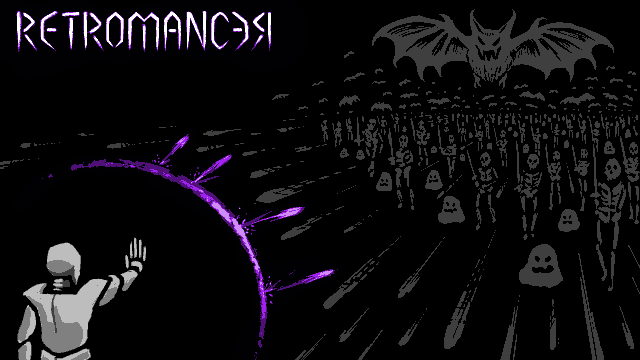
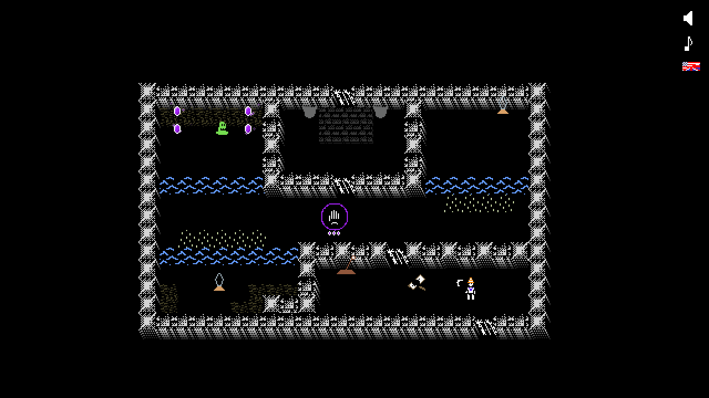

# Retromancer

You are the Retromancer. Time has taken its toll, for the one closest to you has become corrupted and torments the land, simply known as the Lich.

It is your responsibility to save this world through your powers of reversing the effects of time and the damage the Lich has done. Perhaps they can still be saved -- returned to a moment in time before evil overtook them...

This is a 2D puzzle + bullet hell esque game written for the second [ebitengine game jam](https://itch.io/jam/ebitengine-game-jam-2023)

## Features
  * Co-op play, locally or networked (LAN recommended)!
  * Puzzle solving!
  * Cool reflect and deflect abilities!
  * Bullet hell, especially with bosses!
  * 3 total bosses!
  * 2 endings!
  * Optional GPT generated dialog for all the text in the game!
  * Controller support!
  * HATS!!! 
  * Customizable content by editing or overriding the data files that define the levels, bullets, and enemies!

## Customization
If you want to override anything, create an assets directory next to the executable and the game will prefer the contents of that directory over the built-in ones. An example would be to add your own gamepad to the `gamepad.yaml` files in the event your button and axis keybinds don't work out of the box.

Much like [magnet](https://github.com/ketMix/magnet), levels heavily rely on ASCII, so a tool like [ediTTY](https://kettek.net/s/ediTTY/) will help.

All of the maps, enemies, and bullets are defined as YAML files in their respective folders in the `assets` subdirectory.

## Building
`go run .` or `go build .` will suffice to either run or create a build of Retromancer.